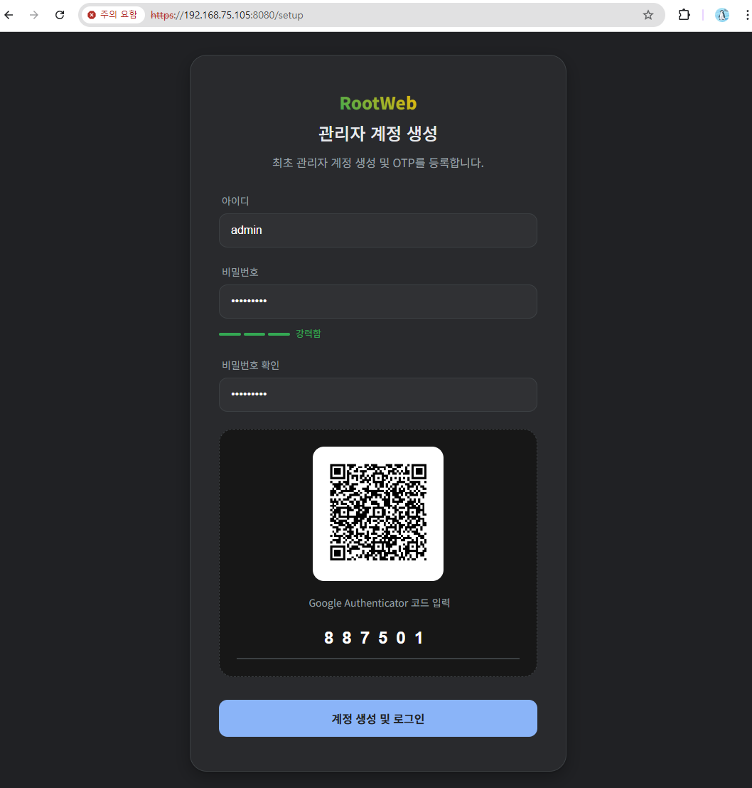
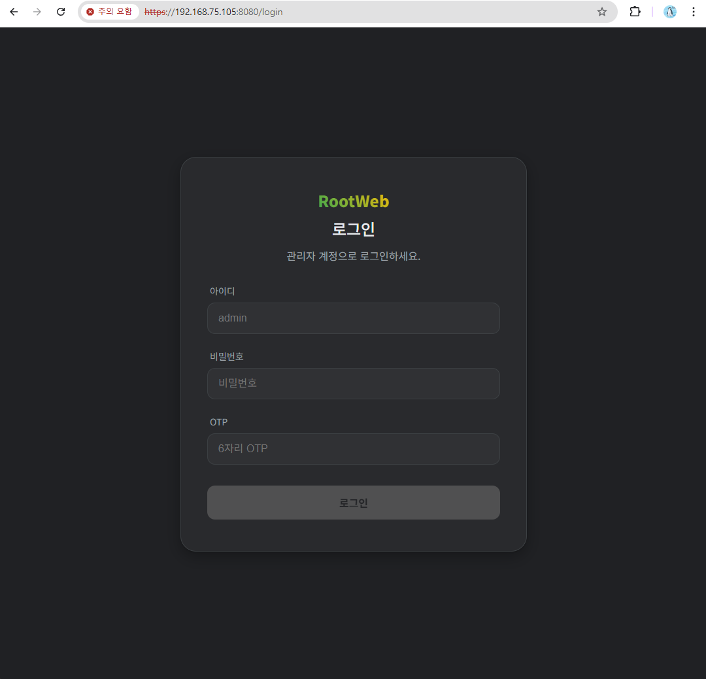
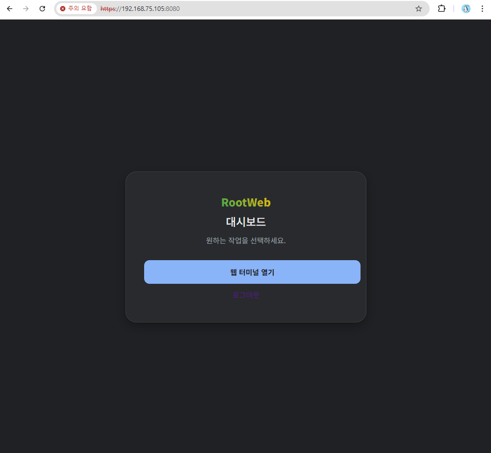
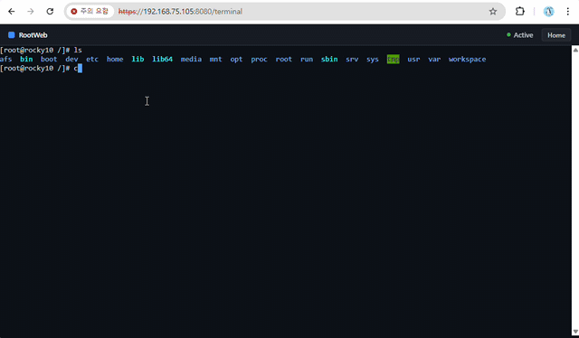

# RootWeb
A high-performance, secure **Web-to-Terminal** gateway and system management server written in Go, featuring a native PTY bridge and TOTP-based multi-factor authentication.

[](https://goreportcard.com/report/github.com/hoon-x/rootweb)


## Quick Start
Experience RootWeb on your Linux server in 3 simple steps:

```bash
# 1. Clone and Build
git clone https://github.com/hoon-x/rootweb.git
cd rootweb
make
cd bin

# 2. Start the server in debug mode (foreground)
./rootweb debug

# 3. Initialize & Connect
# Access https://localhost:8080/setup to register your Admin account
# and scan the TOTP QR code for 2FA.
```

### Images

<p align="center">
  
  
  
  
  <br>
</p>

## Contents
- [Quick Start](#quick-start) - set up and running in 3 steps
- [Features](#features) - Key capabilities
- [Architecture](#architecture) - Technical design
- [Configuration](#configuration) - YAML options
- [Usage](#usage) - CLI commands
- [Security](#security) - 2FA & TLS
- [License](#license)

## Features
- Native Terminal Emulation: Real-time interactive shell access via xterm.js and Linux PTY.
- Robust Daemonization: Native Linux process backgrounding with PID management and graceful shutdown.
- Zero-Config TLS: Automatic generation of self-signed TLS certificates for immediate HTTPS security.
- Enterprise-Grade Auth:
    - Argon2/Bcrypt password hashing.
    - Mandatory TOTP (Google Authenticator) 2-Factor Authentication.
    - Session-idle timeout management (30-minute default).
- Resource Optimized: Automatically tunes GOMAXPROCS for containerized (Docker/K8s) environments.
- Task Management: Structured internal task runner for concurrent services (Server, IPC, Logger).
- Modern Web Stack: Powered by Gin framework for high-throughput API handling.

## Architecture
RootWeb is designed with a layered approach to ensure stability and security:
1. CLI Layer: Cobra-based interface for daemon control (start, stop, debug).
2. Middleware Layer: Hierarchical security checks (Admin existence -> Session Auth -> TOTP).
3. PTY Bridge: Full-duplex WebSocket-to-PTY communication with window resize (SIGWINCH) synchronization.
4. Data Layer: Localized persistence using GORM and SQLite3 for zero-dependency deployment.

## Configuration
RootWeb uses a structured YAML configuration. The configuration file is located in the `config/` directory

### Basic Configuration
```yaml
server:
    enabled: true
    port: 8080
    tlsCertPath: cert/rootweb.crt
    tlsKeyPath: cert/rootweb.key

db:
    dbPath: db/data.db

log:
    maxSize: 10
    maxBackups: 30
    maxAge: 90
    compress: false
```

## Usage

### Server Control
```bash
# Show help or version
./rootweb --help
./rootweb --verison

# Run as a background daemon
./rootweb start

# Stop the running daemon
./rootweb stop

# Run in debug mode (see logs in stdout)
./rootweb debug
```

## Security
RootWeb prioritizes the security of your server's root access:
1. Strict Middleware: All routes except /setup and /login are guarded by a 30-minute sliding window session.
2. TOTP Enrollment: On first launch, the system forces the creation of an admin account and provides a QR code for TOTP enrollment.
3. Encrypted Transport: Non-HTTPS traffic is discouraged; the server defaults to TLS 1.2/1.3 with modern cipher suites and HTTP/2 support.
4. Graceful Shutdown: Upon receiving SIGTERM, the server waits for PTY sessions to close and cleans up PID files.

## License
Copyright 2025 JongHoon Shim.

Licensed under the Apache License, Version 2.0. See LICENSE for details.
